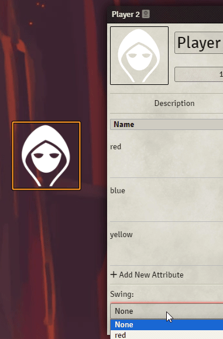

# Sentiment Swing Glow
This module will automatically add a glow matching the Swing color of a character for the [Sentiment TTRPG System](https://github.com/tomlaflin/sentiment) for Foundry VTT.

Glow intensity and blur distance can be adjusted by each user individually in the module's settings.

